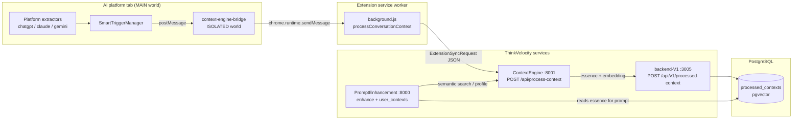

# Essence Flow — Extension → ContextEngine → Backend → Enhancement

This document describes how **conversation JSON** is extracted on AI platforms (ChatGPT, Claude, Gemini), when it is sent for processing, how **essence** is generated and stored, and how stored essence is used later.

**Implementations:** `Extension/`, `Extension-new/`, and **`Sidebar_extension/`** (side panel build). Sidebar uses the same extractors (copied under `content/`) with `essence-smart-trigger.js`, `context-engine-bridge.js`, and `features/essence-context-engine.js` in the service worker (`[TV_ESSENCE]` logs).

---

## 1. High-level architecture



| Stage | Responsibility |
|--------|----------------|
| **DOM extractors** | Turn visible chat UI into structured `messages[]` JSON |
| **SmartTriggerManager** | Decide *when* to send (streaming, word delta, rate limits) |
| **Bridge + background** | Cross-world messaging; wrap payload as **Extension Sync v3** |
| **ContextEngine** | LLM essence extraction, intent/domain taxonomy, embeddings, incremental merge |
| **backend-V1** | Upsert `processed_contexts` (essence text + 1024-dim vector) |
| **PromptEnhancement** | At enhance time, fetch/search contexts and inject MASTER/FLOW into the prompt |

---

## 2. Which platforms have extraction vs enhance-only?

`platforms.js` lists **16+ sites** for the **Enhance button** (textarea detection + injection). **Essence / memory sync** is implemented only where `manifest.json` injects a dedicated extractor + `SmartTriggerManager`:

| Platform | URL (pattern) | Essence extractor | Manifest content scripts |
|----------|---------------|-------------------|---------------------------|
| **ChatGPT** | `chat.openai.com`, `chatgpt.com` | `chatgpt-extractor.js` v3.1.4 | MAIN: extractor + SmartTrigger; ISOLATED: bridge |
| **Claude** | `claude.ai` | `claude-extractor.js` v2.0.0 | Same pattern |
| **Gemini** | `gemini.google.com` | `gemini-extractor.js` v2.0.0 | Same pattern |
| Mistral, Gamma, Bolt, Grok, Suno, Lovable, Replit, V0, Perplexity, Hera, Flow, Kimi, AppAlchemy, Emergent | per `platforms.js` | **None** — enhance button only | No extractor scripts |

Backend `platform` field on saved rows accepts: `chatgpt`, `claude`, `gemini`, `mistral`, `velocity`. Only the first three are populated by the extension today.

**Implication:** Conversation → essence → `processed_contexts` happens **only on ChatGPT, Claude, and Gemini**. On other listed platforms, users can enhance prompts locally, but no DOM conversation is scraped for ContextEngine.

---

## 3. Shared extraction pipeline (all three extractors)

Every extractor implements the same **seven-step DOM pipeline** and exports a global API (`window.VelocityChatGPTExtractor`, etc.).

```text
┌─────────────────────────────────────────────────────────────────┐
│ 1. findConversationRoot()     → scrollable chat container       │
│ 2. collectMessageCandidates() → DOM nodes that might be turns   │
│ 3. filterRealMessages()       → visibility, noise, dedupe       │
│ 4. sort by DOM position       → chronological order             │
│ 5. per node: detectMessageRole + extractTextContent             │
│              + extractRichContent (code, images, tables, …)     │
│ 6. filter JS noise, re-index                                  │
│ 7. assembleConversationPayload() → canonical JSON             │
└─────────────────────────────────────────────────────────────────┘
         │
         ▼
  SmartTracker.performSmartExtraction()  (MutationObserver + URL watch)
         │
         ├─► SessionStore (local compressed chat cache, optional)
         ├─► handleMessagesExtracted (bridge, ack only)
         └─► SmartTriggerManager.onDOMChange → processConversationContext
```

### 3.1 Content script worlds

| World | Scripts | Why |
|-------|---------|-----|
| **MAIN** | `*-extractor.js`, `SmartTriggerManager.js` | Read live DOM |
| **ISOLATED** | `context-engine-bridge.js` | `chrome.runtime.sendMessage` |

### 3.2 Per-platform DOM differences

The pipeline is shared; **strategies 1b / 7 and root-finding** differ by site.

| Step | ChatGPT | Claude | Gemini |
|------|---------|--------|--------|
| **Root** | `<main>` or `[role="main"]`, then `[data-testid*="conversation"]`, `agent-turn` / `user-turn` containers | `<main>` only if it contains messages; **scroll container** with ≥2 message groups; **ancestor of `[data-message-id]`** (scored walk up 15 levels) | Same family as Claude (shared Strategy 4a/4b logic) |
| **Collect — primary** | `[data-message-author-role]`, `[data-message-id]`, `article`, `[data-testid*="turn"]`, `[class*="agent-turn"]` | Same + **Strategy 1b**: `MessageGroup`, `message-content`, `claude-message`, `human-message` (≥30 chars or child divs ≥20 chars) | Same as Claude but **Strategy 1b** uses `gemini-message` class hints |
| **Collect — ChatGPT-only** | Strategy 5.5: `[data-testid*="chat-message"]`, `[class*="message-wrapper"]` | Strategy 7: aggressive `motion.div` / text `motion` scan if zero candidates | Strategy 7: aggressive div scan if zero candidates |
| **Role detection** | `data-message-author-role` → testids → heuristics (code/lists/length) → **index % 2** fallback | Same; assistant img alt may match **Claude** | Same; assistant img alt may match **Gemini** |
| **Timestamps** | Synthetic: `now - (n-1)*25s` per message (`TIMESTAMP_INTERVAL_MS`) | Same | Same |
| **Rich content** | codeBlocks, images, files, tables, formulas, artifacts | Same set | Same set |
| **Auto-track** | `SmartTracker` + `MutationObserver` on conversation root; streaming debounce | Same architecture | Same architecture |
| **Public API** | `VelocityChatGPTExtractor.extractConversation()` | `VelocityClaudeExtractor.extractConversation()` | `VelocityGeminiExtractor.extractConversation()` |

Claude and Gemini source files are largely parallel (~5k–6k lines each); ChatGPT is the most evolved (URL chat id cache, sidebar extract, richer ChatGPT-specific selectors).

### 3.3 `filterRealMessages()` — what gets dropped

Applied identically on all three platforms:

- Hidden / zero-size elements
- `isNoiseElement()` (nav, buttons, chrome UI)
- Empty text unless `pre`/`img` present (then placeholder `[Rich content: …]`)
- `isJavaScriptNoise()` (analytics/script snippets)
- Too short text (`MIN_TEXT_LENGTH` = 5, or 2 if rich content)
- Duplicate first-200-char signature

If zero messages after filter, ChatGPT runs **extra fallback** queries on `article`, `[class*="message"]`, `[data-message-id]`, etc.

### 3.4 Auto-tracking → essence trigger

Each extractor’s `SmartTracker`:

1. Watches URL for chat id changes (`new_conversation` / `chat_changed`).
2. `MutationObserver` on conversation root (ignores sidebar/nav mutations).
3. On change → `performSmartExtraction()` → `extractConversation()`.
4. Wraps payload in `changeEvent` → `smartTrigger.onDOMChange()`.
5. After debounce, `shouldTriggerEssenceUpdate()` must pass → `sendToContextEngine()`.

Triggers include: `initial_load`, `chat_changed`, `url_refresh`, `streaming_complete`, `dom_change`.

### 3.5 Extracted JSON shape (before sync)

After assembly, a typical payload looks like:

```json
{
  "success": true,
  "sessionId": "session_1716123456789_abc12",
  "chatId": "<from URL or cache>",
  "platform": "chatgpt",
  "extractorVersion": "3.1.4",
  "extractedAt": 1716123456789,
  "url": "https://chatgpt.com/c/...",
  "messageCount": 12,
  "messages": [
    {
      "role": "user",
      "content": "How do I ...",
      "timestamp": 1716123400000,
      "index": 0,
      "contentType": "plain"
    },
    {
      "role": "assistant",
      "content": "...",
      "timestamp": 1716123401000,
      "index": 1,
      "contentType": "rich",
      "codeBlocks": [{ "language": "python", "code": "..." }],
      "images": []
    }
  ],
  "richContentSummary": { "totalCodeBlocks": 1, "messagesWithRichContent": 1 },
  "userId": "12345",
  "user": { "user_id": "12345", "accessToken": "...", "usage_left": 100 }
}
```

**Notes:**

- `sessionId` is generated per extraction batch (`generateSessionId()`), while `chatId` often comes from the URL — SmartTrigger also tracks `currentConversationId` to reset word counters on chat switch.
- Rich fields (`codeBlocks`, `images`, …) are flattened to text placeholders when adapting for ContextEngine (see below).
- User/auth fields come from `SessionStore.extractUserInfo()` (tokens synced from thinkvelocity.in).

### 3.6 Local / debug storage

Extractors can log and expose helpers (e.g. `showJSON()` in verbose mode). **SmartTrigger** persists throttle state in `chrome.storage.local` / `localStorage` key `smartTriggerState` — not the full conversation. The canonical store for processed essence is **PostgreSQL** via backend-V1.

---

## 4. When JSON is sent (SmartTriggerManager)

`content/SmartTriggerManager.js` listens for conversation changes (mutations, streaming end, new conversation) and calls `shouldTriggerEssenceUpdate()` before `sendToContextEngine()`.

**Typical gates (must pass):**

| Check | Default | Purpose |
|--------|---------|---------|
| Not streaming | debounce ~1s | Wait for assistant reply to finish |
| `minTimeBetweenUpdates` | 1000 ms | Throttle bursts |
| `minWordCountDelta` | 10 words | Avoid tiny edits |
| `minMessages` | 5 | Need enough conversation depth |
| `maxUpdatesPerHour` | 60 | Rate limit API cost |
| Conversation switch | resets `lastWordCount` | New chat = fresh baseline |

On success, MAIN world posts to the bridge:

```javascript
window.postMessage({
  type: 'CONTEXT_ENGINE_BRIDGE',
  action: 'processConversationContext',
  requestId: 'smart_trigger_...',
  extractedData: conversationData.conversation, // inner conversation object
  triggerType: 'smart_trigger',
  autoTriggered: true
}, '*');
```

`handleMessagesExtracted` is a separate fire-and-forget path (bridge → background) used when extractors notify incremental message counts; background currently **acknowledges only** (`{ success: true }`) and does not persist by itself.

Manual/debug: `window.triggerContextEngineDirect()` builds the same **ExtensionSyncRequest** and can POST from the page (dev tooling).

---

## 5. Background transformation (Extension Sync v3)

`background.js` handler `processConversationContext` maps `extractedData` → **bulk sync** body expected by ContextEngine:

```json
{
  "sessionId": "<chat/session id>",
  "sessionStartedAt": 1716123456789,
  "exportedAt": 1716123456789,
  "platform": "chatgpt",
  "extractorVersion": "3.1.4",
  "user": {
    "user_id": "12345",
    "usage_left": 100,
    "accessToken": "<JWT>"
  },
  "stats": {},
  "conversations": [{
    "chatId": "<same as session>",
    "title": "Chat Conversation",
    "url": "https://...",
    "model": "gpt-4",
    "updatedAt": 1716123456789,
    "messages": [
      {
        "role": "user",
        "content": "...",
        "timestamp": "2024-05-19T12:00:00.000Z",
        "index": 0,
        "contentType": "plain",
        "images": [],
        "codeBlocks": []
      }
    ]
  }]
}
```

- Platform names are normalized (`openai` → `chatgpt`, etc.).
- Production URL used in tree: `POST https://thinkvelocity.in/context-engine/api/process-context` (with retries).
- Requires logged-in `user_id` for meaningful persistence; `unknown_user` logs a warning.

Pydantic model: `ContextEngine/src/api/extension_schemas.py` → `ExtensionSyncRequest`.

### 5.1 How extracted JSON is stored locally (Sidebar_extension)

Two-tier mirror, identical to `Extension` / `Extension-new`:

| Tier | Where | Keys | Lifetime | Purpose |
|------|-------|------|----------|---------|
| Page localStorage (AI host tab, MAIN world) | `chatgpt.com` / `claude.ai` / `gemini.google.com` | `velocity_chatgpt_session`, `velocity_Claude_session`, `velocity_gemini_session` | 24 h rolling | Full conversations: `sessionId`, `conversations[chatId] = { title, url, messages, …, isCompressed }`, `visitOrder`, `stats`. Messages > 100 chars are LZ-compressed and validated by hash. Cross-tab synced via `window.addEventListener('storage', …)`. |
| Page localStorage (smart trigger) | Same host tabs | `smartTriggerState` | Hourly counter, persisted | Throttle state: `lastUpdateTime`, `lastWordCount`, `updatesThisHour`, `analytics`. Falls back to `chrome.storage.local.smartTriggerState` when localStorage unavailable. |
| chrome.storage.local (extension context) | Sidebar service worker | `velocity_essence_last_stored_at`, `velocity_essence_last_session` | Until cleared | Refresh signal for Memory tab (existing). |
| chrome.storage.local (extension context) | Sidebar service worker | `velocity_last_extracted_summary`, `velocity_extracted_by_platform` | Until cleared | **New.** Compact mirror of the most recent successful ContextEngine sync, so the side panel can read recent activity without crawling page localStorage. |

#### Compact mirror shape (chrome.storage.local)

Written by `TV.extractedConversationStore.recordExtraction(contextPayload)` immediately after a successful `POST /api/process-context`.

```json
{
  "velocity_last_extracted_summary": {
    "platform": "chatgpt",
    "sessionId": "session_1716123456789_abc12",
    "chatId": "<chat URL id>",
    "title": "Chat Conversation",
    "url": "https://chatgpt.com/c/...",
    "messageCount": 12,
    "extractorVersion": "3.1.4",
    "syncedAt": 1716123456789
  },
  "velocity_extracted_by_platform": {
    "chatgpt": { "...": "same shape" },
    "claude":  { "...": "same shape" },
    "gemini":  { "...": "same shape" }
  }
}
```

Side-panel modules read this via `chrome.storage.local.get([...])` and listen for changes through `chrome.storage.onChanged`. The full conversation JSON is **not** duplicated into `chrome.storage.local`; only the compact summary lives there. Essence (MASTER/FLOW + embedding) remains the database source of truth in `processed_contexts`.

All keys are centralized in `core/storage-keys.js` (`TV.STORAGE_KEYS`).

---

## 6. Conversion chain: JSON → essence → database

This is the full transformation after the extension sends bulk JSON.

```mermaid
flowchart TB
  subgraph Ext["Extension payload"]
    A[ExtensionSyncRequest<br/>conversations[].messages]
  end

  subgraph CE_Adapt["ContextEngine adapter"]
    B[Flat ChatMessage list<br/>role + text per turn]
    C["Groq: role: user/assistant lines<br/>truncated to ~60k chars tail"]
  end

  subgraph CE_LLM["Single Groq call per update"]
    D[Structured text response]
    E[Parse PrimaryDomain, PrimaryIntent, Essence block]
    F[IntentTaxonomy.normalize_primary_intent]
  end

  subgraph CE_Merge["EssenceUpdater"]
    G{Previous row<br/>same topic_id?}
    H[full: MASTER only<br/>FLOW stripped]
    I[incremental: PREVIOUS ESSENCE + new msgs<br/>MASTER + FLOW ≤2 bullets]
  end

  subgraph CE_Out["Outputs"]
    J[NVIDIA embedding 1024-dim<br/>on final essence string]
    K[POST processed-context]
  end

  A --> B --> C --> D --> E --> F --> G
  G -->|no / domain shift| H
  G -->|same domain| I
  H --> J
  I --> J
  J --> K
```

| Step | Input | Output |
|------|--------|--------|
| **Adapter** | `ExtensionChatMessage` with `content`, `codeBlocks`, `images` | One string per turn: text + `[Image: alt]` + fenced code |
| **Format for LLM** | `[{role, content}, …]` | `user: …\nassistant: …\n` (tail-truncated) |
| **Groq extract** | Conversation text + `ESSENCE_EXTRACTION_PROMPT` | Fixed-field text (not JSON) with `Essence:\nMASTER:…\nFLOW:…` |
| **Parse** | Raw LLM string | `essence`, `raw_primary_domain`, `raw_primary_intent`, secondaries |
| **Normalize** | Raw macro labels | Taxonomy-enforced intent; domains as returned |
| **Topic key** | `user_id` + primary domain | `session_id` stored in DB = `{userId}_{primaryDomain}` |
| **Update type** | Previous essence + domain overlap | `full` / `incremental` / `none` |
| **Embed** | Final essence prose | `float[1024]` |
| **Persist** | `ProcessedContextData` | Row in `processed_contexts` |

**Important:** Intent and domain classifiers in `ContextProcessorService` call the **same** `GroqContextExtractor.extract_all()` as essence generation — in practice the processor runs classification calls **and** updater runs generation; the unified extractor caches one Groq response per message batch inside `extract_all`.

Incremental path injects prior essence as a synthetic system message:

```python
hinted_messages = [
  {"role": "system", "content": f"PREVIOUS ESSENCE:\n{previous_essence}"}
] + new_messages
```

That triggers the prompt rule: *if PREVIOUS ESSENCE present → emit both MASTER and FLOW*.

---

## 7. ContextEngine processing (detail)

### 7.1 Adapter (extension → internal)

`ExtensionAdapterService.convert_to_process_requests()`:

- Validates numeric `userId`.
- Flattens all `conversations[].messages` into one `ProcessContextRequest.messages` list.
- `ContentExtractor.extract_text()` merges `content` + `[Image: alt]` + fenced code into a single string per message.

### 7.2 Orchestration (`ContextProcessorService.process`)

Order of operations:

1. **Classify intent** (Groq) — macro + secondary intent.
2. **Extract domains** (Groq) — primary + secondary list.
3. **Topic identity** — `topic_id = "{user_id}_{primary_domain}"` (domain is the persistence key; browser `sessionId` is trace metadata only).
4. **Load previous row** — `GET /api/v1/processed-context/session/{topic_id}?userId=...` via `HttpContextRepository`.
5. **Topic similarity** (optional) — cosine similarity between previous essence embedding and embedding of new messages (logging / signals).
6. **Update decision** — `decide_update_type()` → `full` | `incremental` | `none` (domain shift → full recompute).
7. **EssenceUpdater** — Groq with `ESSENCE_EXTRACTION_PROMPT` (`prompts/essence_extraction.py`):
   - **Full**: no previous essence → **MASTER only** (FLOW stripped).
   - **Incremental**: passes `PREVIOUS ESSENCE:` + new messages → **MASTER + FLOW** (FLOW capped to 2 bullets).
8. **Embedding** — NVIDIA (1024-dim) on final essence text.
9. **Version / limits** — max **5** updates per topic (`version >= 5` returns existing row); free-tier cap enforced again at Node (see §6).
10. **Save** — `POST /api/v1/processed-context` with essence, intent, domains, embedding, version, platform.

### 7.3 Essence text format (stored string)

LLM output is parsed in `SummarizationService._parse_llm_response()` into fields, then stored as a single `essence` column, e.g.:

```
PrimaryDomain: software_data_engineering
SecondaryDomains: api_design, nodejs
PrimaryIntent: construction
SecondaryIntent: refactoring_api
Essence:
MASTER:
Long-term trajectory sentence about the user's capability in this domain.

FLOW:
- Current batch focus bullet one
- Optional second bullet
```

`EssenceValidator` enforces MASTER/FLOW structure, compresses FLOW, and strips FLOW on full recompute.

---

## 8. Backend persistence (backend-V1)

**Endpoint:** `POST /api/v1/processed-context` (authenticated)  
**Controller:** `processedContextController.js` → `createProcessedContext()` in `processedContextModel.js`

**Table:** `processed_contexts` (upsert by `session_id` + `user_id`)

| Column | Content |
|--------|---------|
| `session_id` | ContextEngine **topic_id** (`{userId}_{primaryDomain}`), not the browser tab session |
| `essence` | Full structured essence string (MASTER/FLOW) |
| `intent` | Primary macro-intent |
| `domains` | Array (primary + secondary) |
| `embedding` | `vector(1024)` — padded/truncated if needed |
| `message_count`, `platform`, `version` | Metadata |

**Free tier:** `FREE_MEMORY_ESSENCE_LIMIT = 5` distinct memory rows per user (`MEMORY_CAP_EXCEEDED` on 6th new session).

**Read paths used later:**

- `GET /api/v1/processed-context/session/{sessionId}?userId=`
- `GET /api/v1/processed-context` (list)
- `POST /api/v1/processed-context/public/search` — pgvector semantic search

---

## 9. Downstream use (after storage)

### 9.1 Prompt enhancement

On `POST /enhance/stream`, **PromptEnhancement** aggregates context:

- `ContextEngineClient.search_relevant_contexts()` → `POST /api/search/contexts` (embedding similarity).
- `enhance_prompt.py` splits each essence into **MASTER** (long-term background) and **FLOW** (recent focus) for the enhancement system prompt.
- Guidance tells the model: use MASTER/FLOW only when they improve the current prompt.

Extension enhance flow (`Button/js/api.js`) does **not** read essence directly from the DB; it relies on PromptEnhancement + ContextEngine when `user_id` and Context Engine integration are enabled.

### 9.2 Website / memory UI

Vel-Next-Live-working surfaces “memory” in product copy and components like `MemoryGraph.jsx`; persisted essence rows are loaded via backend APIs (same `processed_contexts` data). Manual essence can also be ingested via ContextEngine `POST /api/process-essence` → same save path.

### 9.3 User profile aggregation

ContextEngine `GET /api/user/{user_id}/profile` aggregates domains, intents, and recent essences for analytics and optional enhancement context.

---

## 10. End-to-end sequence (happy path)

```text
User chats on ChatGPT (≥5 turns, streaming finished, +10 words since last send)
  → VelocityChatGPTExtractor.extractConversation() → messages JSON
  → SmartTriggerManager.sendToContextEngine()
  → context-engine-bridge postMessage
  → background.js builds ExtensionSyncRequest
  → POST /context-engine/api/process-context
  → ExtensionAdapter → ProcessContextRequest (flat messages)
  → Groq: intent + domain + essence (incremental if same domain topic exists)
  → NVIDIA: embedding(essence)
  → POST /api/v1/processed-context → processed_contexts row
Later: user hits Enhance on same account
  → PromptEnhancement searches/fetches contexts
  → MASTER/FLOW injected into enhancement prompt
```

---

## 11. Extension vs Extension-new

| Area | Extension | Extension-new |
|------|-----------|----------------|
| Extractors + SmartTrigger + bridge | Same pattern | Same files / behavior |
| `processConversationContext` in background | Same | Same |
| Extra UI | Popup + injected button | Adds `Extension/context-panel.js`, `contextForm.js`, site context actions (attachments, page extract) — **orthogonal** to essence sync unless wired to call the same bridge actions |
| Essence pipeline | Identical | Identical |

For essence-specific work, treat both folders as one implementation duplicated for product variants.

---

## 12. Key files reference

| Layer | Path |
|-------|------|
| ChatGPT DOM → JSON | `Extension/content/chatgpt-extractor.js` (`extractConversation`, `assembleConversationPayload`) |
| Trigger logic | `Extension/content/SmartTriggerManager.js` |
| MAIN ↔ extension | `Extension/content/context-engine-bridge.js` |
| Sync payload + HTTP | `Extension/background.js` (`processConversationContext`) |
| API schema | `ContextEngine/src/api/extension_schemas.py` |
| Adapter | `ContextEngine/src/application/extension_adapter.py` |
| Essence LLM prompt | `ContextEngine/prompts/essence_extraction.py` |
| Processor | `ContextEngine/src/application/context_processor.py` |
| Incremental logic | `ContextEngine/src/application/incremental_essence_updater.py`, `update_decision.py` |
| Persist client | `ContextEngine/src/infrastructure/http_repository.py` |
| DB upsert | `backend-V1/models/processedContextModel.js` |
| Enhance consumption | `PromptEnhancement/src/application/enhance_prompt.py`, `infrastructure/context/context_engine_client.py` |

---

## 13. Operational constraints (quick reference)

- **Auth:** JWT in `user.accessToken` should reach ContextEngine → Node save headers.
- **Platform enum:** `chatgpt`, `claude`, `gemini`, `mistral`, `velocity`.
- **Topic cap:** 5 essence versions per `{userId}_{primaryDomain}` in ContextEngine; 5 memory **rows** for free users at Node.
- **Truncation:** Conversations truncated at `CONVERSATION_TRUNCATION_LIMIT` (~60k chars), keeping the **tail** for Groq.
- **Identity:** One logical “memory topic” per user per primary domain; switching domain creates/updates a different `session_id` key in DB.

---

## 14. Related docs

- `Extension/CLAUDE.md` — module map and conventions  
- `Extension/EXTENSION_API_FLOW.md` — enhance/refine API (separate from essence sync)  
- `CLAUDE.md` (repo root) — cross-service architecture  
