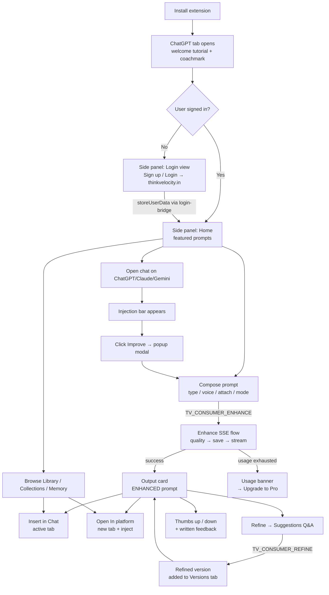

# PostHog Analytics Plan — Velocity Sidebar Extension

**Scope:** `Sidebar_extension/` (Chrome MV3 side panel + on-page injection bar + launcher)
**Goal:** Identify the full user journey, name every meaningful event, and define the funnels we want to measure in PostHog.
**Status:** Plan / blueprint — no instrumentation code shipped yet (`Phase 5 → 5.3` in `CHANGES.md`).

---

## 1. Surfaces the user interacts with

The extension has **four surfaces**. Every PostHog event MUST carry a `surface` property so dashboards can split by where the action happened.

| `surface` value | What it is | Primary files |
|---|---|---|
| `side_panel` | Chrome side panel (consumer flow) | `panel/consumer/*` |
| `injection_bar` | Floating "Improve Prompt" bar above the chat input on AI host pages | `button/js/injection-button.js` |
| `popup_modal` | Draggable enhance/refine popup opened from the bar | `button/js/injection-modal.js` |
| `launcher` | Right-edge floating pill that opens the side panel | `button/js/side-panel-launcher.js` |
| `tutorial` | Post-install welcome popup | `panel/tutorial/*` |
| `background` | Service-worker driven events (auto-capture, errors) | `background.js`, `features/essence-context-engine.js` |

---

## 2. User flow at a glance



---

## 3. Journey stages and the events to fire

Each stage below lists:
- **Trigger** — what the user does
- **Code touchpoint** — file/function that already exists
- **Event(s)** — exact PostHog event name(s) and key properties

> Naming convention: `snake_case`, verb-last (e.g. `enhance_requested`, not `requested_enhance`). Use past tense for completed actions, `_clicked` only for raw clicks.

### 3.1 Install & first-run

| Trigger | Code touchpoint | Event | Key properties |
|---|---|---|---|
| Extension installed | `background.js:onInstalled` | `extension_installed` | `version`, `previous_version`, `reason` |
| Welcome tutorial shown | `panel/tutorial/tutorial.js` | `tutorial_viewed` | `source` (`post_install` / `manual`) |
| Tutorial video step plays | `tutorial.js` | `tutorial_step_viewed` | `step` (1–3) |
| Clicked "Try Velocity" | `tutorial.js` | `tutorial_completed` | — |
| Closed tutorial | `tutorial.js` | `tutorial_dismissed` | `dismiss_reason` |
| Welcome coachmark shown next to injection bar | `injection-button.js:showWelcomeCoachmark` | `welcome_coachmark_shown` | `host_platform` |
| Coachmark dismissed | `injection-button.js:dismissWelcomeCoachmark` | `welcome_coachmark_dismissed` | `dismiss_reason` (`close` / `cta` / `timeout`) |

### 3.2 Auth & login

| Trigger | Code touchpoint | Event | Key properties |
|---|---|---|---|
| Side panel opens | `sidebar.js` (boot) | `side_panel_opened` | `auth_state`, `entry_source` |
| Login view shown | `sidebar.js:showLoginView` | `login_view_shown` | `is_first_session` |
| Sign up clicked | `welcomeSignupBtn` | `signup_clicked` | — |
| Login clicked | `welcomeLoginBtn` | `login_clicked` | — |
| Login tab opened | `TV_AUTH_OPEN_LOGIN` reply | `login_tab_opened` | — |
| Sign-in succeeded | `background.js:storeUserData` | `auth_succeeded` | `user_id`, `user_email`, `sidebar_flow` |
| Sign-in failed | `storeUserData` error | `auth_failed` | `error_code`, `error_message` |
| Subscription status loaded | `fetchUserStatus` | `subscription_status_loaded` | `subscription_status`, `is_pro_user`, `remaining_usage`, `usage_limit` |
| Logout | `TV_AUTH_LOGOUT` | `logout_clicked` | `from` |

> On `auth_succeeded`, also call `posthog.identify(user_id, { email, name, sidebar_flow, subscription_status })`.

### 3.3 Side-panel navigation

| Trigger | Code touchpoint | Event | Key properties |
|---|---|---|---|
| Rail button clicked | `railNewChat / railLibrary / railCollection / railMemories / railProfile` | `rail_clicked` | `rail_item` |
| View shown | `switchTab` / `showPanelFallback` | `panel_view_shown` | `view`, `from_view`, `is_session_active` |
| Home featured prompt clicked | `buildHomePromptCard` | `home_featured_prompt_clicked` | `prompt_id`, `prompt_title`, `is_pro_only`, `is_locked` |
| "View more" prompts | `btnShowMorePrompts` | `home_show_more_prompts_clicked` | — |
| Session tab switched | `switchTab` | `session_tab_switched` | `to_tab`, `from_tab` |
| New chat | `railNewChat` after `resetSession` | `new_chat_started` | — |
| Restored saved view on reopen | `restoreSavedView` | `view_state_restored` | `restored_panel`, `restored_tab` |

### 3.4 Enhance (the headline funnel)

Same event names fire from the side panel composer **and** the on-page popup modal — split by `surface`.

| Trigger | Code touchpoint | Event | Key properties |
|---|---|---|---|
| Composer focused | `promptInput` focus | `composer_focused` | — |
| Mode menu opened | `sbModeBtn` | `mode_menu_opened` | — |
| Mode selected | `sb-mode-option` click | `mode_selected` | `mode` (`standard`/`build`/`media`/`best`), `requires_pro`, `was_locked` |
| Locked Pro mode clicked | locked option in `wireModeDropdown` | `mode_locked_upgrade_clicked` | `mode` |
| Attach menu opened | `attachMenuBtn` | `attach_menu_opened` | — |
| Attachment added | `pushAttachment` | `attachment_added` | `kind` (`file`/`page`), `mime`, `size_bytes`, `total_attachments` |
| Attachment removed | `removeAttachment` | `attachment_removed` | `kind` |
| Extract page clicked | `attachMenuExtract` | `page_extract_clicked` | — |
| Page extract result | `TV_EXTRACT_PAGE_CONTEXT` reply | `page_extract_succeeded` / `page_extract_failed` | `url_host`, `extracted_chars`, `error_message` |
| Mic clicked | `voiceMicBtn` | `voice_mic_clicked` | — |
| Recording lifecycle | voice ctrl `onStateChange` | `voice_recording_started` / `voice_recording_paused` / `voice_recording_stopped` | `duration_seconds` |
| Transcript received | `onTranscript` | `voice_transcribed` | `chars`, `duration_seconds` |
| Voice error | `onError` | `voice_error` | `error_name`, `error_message` |
| Mic permission denied | `permState === "denied"` | `voice_permission_blocked` | — |
| **Enhance requested** | `TV_CONSUMER_ENHANCE` sent | **`enhance_requested`** | `surface`, `mode`, `prompt_length`, `prompt_word_count`, `has_attachments`, `attachment_count`, `has_voice_input`, `host_platform`, `is_pro_user`, `remaining_usage_before` |
| **Enhance succeeded** | `consumer-enhance-flow.js:runEnhance` ok | **`enhance_succeeded`** | + `prompt_id`, `enhanced_length`, `quality_intent`, `quality_domain`, `duration_ms`, `remaining_usage_after` |
| **Enhance failed** | error path | **`enhance_failed`** | `error_code`, `error_message`, `duration_ms` |
| Usage limit blocked enhance | `ensureCanConsumeUsage` returns false | `usage_limit_blocked` | `surface` |
| Usage banner shown | `usage-limit-banner.js` | `usage_limit_banner_shown` | — |
| Upgrade clicked | `usageLimitBannerUpgrade` | `usage_limit_upgrade_clicked` | `from` |

### 3.5 Output card, Refine, Versions, Feedback

| Trigger | Code touchpoint | Event | Key properties |
|---|---|---|---|
| Output card rendered | `outputView.show` | `output_view_rendered` | `prompt_id`, `mode`, `is_pro_enhanced` |
| ORIGINAL collapsible toggled | `buildOriginalCollapsible` | `original_collapsible_toggled` | `expanded` |
| Edit (pencil) | `_onEdit` | `output_edit_clicked` | `prompt_id` |
| Copy | `copyToClipboard` | `output_copy_clicked` | `prompt_id`, `text_length` |
| Bookmark/save (stub) | header bookmark | `output_save_clicked` | — |
| Thumbs up | `onFeedback({feedback:"like"})` | `output_thumb_up_clicked` | `prompt_id`, `mode` |
| Thumbs down | `onFeedback({feedback:"dislike"})` | `output_thumb_down_clicked` | `prompt_id`, `mode` |
| Feedback popup opened | `feedbackPopup.show` | `feedback_popup_shown` | `reason`, `source` |
| Written feedback sent | `TV_CONSUMER_SUBMIT_FEEDBACK` success | `feedback_written_submitted` | `reason`, `feedback_length` |
| Written feedback failed | error path | `feedback_written_failed` | `error_message` |
| Refine pill clicked | `_onRefine` | `refine_pill_clicked` | `prompt_id` |
| Improve Prompt clicked | `btnComposerImprove` | `improve_prompt_clicked` | — |
| Clarify result | `TV_CONSUMER_CLARIFY` | `clarify_requested` / `clarify_succeeded` / `clarify_failed` | `question_count`, `error_message` |
| Question viewed | suggestions paging | `clarify_question_viewed` | `question_index`, `question_id` |
| Option chosen | suggestions option click | `clarify_option_selected` | `question_index`, `is_other`, `option_label` |
| "Other" text saved | suggestions other-save | `clarify_other_text_saved` | `question_index`, `text_length` |
| Refine submitted | `TV_CONSUMER_REFINE` | `refine_requested` / `refine_succeeded` / `refine_failed` | `qa_count`, `refined_length`, `refine_number`, `error_message` |
| Custom free-form refine | `submitCustomRefine` | `custom_refine_submitted` | `text_length` |
| Versions tab shown | `switchTab("versions")` | `versions_view_shown` | — |
| Use this version | `versions-view.js:onUse` | `version_use_in_output_clicked` | `label` (ENHANCED / REFINED N / ORIGINAL) |

### 3.6 Deliver to chat (Insert / Open In)

| Trigger | Code touchpoint | Event | Key properties |
|---|---|---|---|
| Insert in Chat clicked | `_onInsertInChat`, library `onInsertPrompt` | `insert_in_chat_clicked` | `source` (`output`/`library`/`collections`/`prompt_book`), `host_platform` |
| Insert succeeded | `TV_CONSUMER_INSERT_ACTIVE_TAB` ok | `insert_in_chat_succeeded` | `platform`, `prompt_length` |
| Fell back to sidebar composer | `insertPromptIntoActiveTabChat` fallback | `insert_in_chat_fell_back_to_composer` | `error_message` |
| Insert failed | final error path | `insert_in_chat_failed` | `error_message` |
| Open In menu opened | output dropdown | `open_in_menu_opened` | `source` |
| Platform selected | dropdown option | `open_in_platform_selected` | `platform_key`, `source` |
| Platform opened | `TV_CONSUMER_OPEN_IN_PLATFORM` ok | `open_in_platform_opened` | `platform_key` |
| Open failed | error path | `open_in_platform_failed` | `platform_key`, `error_message` |

### 3.7 Library / Collections / Memory

| Trigger | Code touchpoint | Event | Key properties |
|---|---|---|---|
| Library opened | `prompt-library-view.js:onShown` | `library_opened` | `source` (`rail`/`home_more`/`pending_inject`) |
| Search typed (debounced) | `librarySearch` input | `library_search_typed` | `query_length`, `result_count` |
| Filter chip clicked | `libraryFilterRow` | `library_filter_clicked` | `category` |
| Card clicked | library card click | `library_card_clicked` | `prompt_id`, `is_pro_only`, `is_locked` |
| Detail modal opened/closed | library detail | `library_detail_opened` / `library_detail_closed` | `prompt_id` |
| Copy | library copy btn | `library_copy_clicked` | `prompt_id` |
| Insert in chat from library | `onInsertPrompt` | `library_insert_in_chat_clicked` | `prompt_id` |
| Open in platform from library | `onOpenInPlatform` | `library_open_in_platform_clicked` | `prompt_id`, `platform_key` |
| Paywall shown | locked detail opened | `library_paywall_shown` | `prompt_id` |
| Upgrade clicked | paywall CTA | `library_upgrade_cta_clicked` | `from` |
| Collections opened | `views.showCollections` | `collections_opened` | — |
| New collection clicked / created | `btnNewCollection` / `TV_CONSUMER_CREATE_COLLECTION` | `collection_create_clicked` / `collection_created` / `collection_create_failed` | `error_message` |
| Collection opened | collection card click | `collection_opened` | `collection_id`, `prompt_count` |
| Prompt book opened | `promptBookList` shown | `prompt_book_opened` | — |
| Prompt book item clicked | item click | `prompt_book_item_clicked` | `prompt_id`, `mode_tag`, `platform_tag` |
| Continue in chat from prompt book | `continuePromptBookInChat` | `prompt_book_continue_in_chat` | `prompt_id` |
| Memory opened | `views.showMemory` | `memory_opened` | — |
| Memory empty state | `memoryEmpty` shown | `memory_empty_state_shown` | — |
| Memory CRUD | `TV_CONSUMER_*_MEMORY` | `memory_created` / `memory_updated` / `memory_deleted` | `memory_id`, `essence_length` |
| Memory CRUD failed | error path | `memory_action_failed` | `action`, `error_message` |

### 3.8 On-page injection bar & popup modal

| Trigger | Code touchpoint | Event | Key properties |
|---|---|---|---|
| Bar shown | `positionBar` first paint | `injection_bar_shown` | `host_platform` |
| Bar hidden | `hideBar` | `injection_bar_hidden` | `host_platform` |
| Bar dragged | `onMorePointerUp` (wasDrag) | `injection_bar_dragged` | `host_platform` |
| Bar expanded / collapsed | `setGroupExpanded` | `injection_bar_expanded` / `injection_bar_collapsed` | `pinned` |
| Improve clicked | `improveBtn` click | `injection_enhance_clicked` | `host_platform`, `prompt_length` |
| Library shortcut clicked | bar library btn | `injection_library_clicked` | `host_platform` |
| Collections shortcut clicked | bar collection btn | `injection_collection_clicked` | `host_platform` |
| Popup opened | `injection-modal.js:open` | `injection_popup_opened` | `tab`, `host_platform` |
| Popup closed | modal close | `injection_popup_closed` | `host_platform`, `duration_ms` |
| Popup tab switched | tab change in modal | `injection_popup_tab_switched` | `to_tab` |
| Accept (insert back into host input) | modal Accept | `injection_popup_accept_clicked` | `host_platform`, `text_length` |
| Copy / Edit in popup | modal buttons | `injection_popup_copy_clicked` / `injection_popup_edit_clicked` | — |
| Sign-in CTA in popup | anonymous user CTA | `injection_popup_signin_clicked` | — |
| Pro upgrade in popup | upgrade CTA | `injection_popup_pro_upgrade_clicked` | `from_tab` |

### 3.9 Right-edge launcher

| Trigger | Code touchpoint | Event | Key properties |
|---|---|---|---|
| Launcher shown | `side-panel-launcher.js` boot | `launcher_shown` | `host_platform` |
| Discovery pulse shown | one-time pulse | `launcher_pulse_shown` | — |
| Launcher clicked → opens side panel | `TV_OPEN_SIDE_PANEL` from launcher | `launcher_clicked` | `host_platform` |
| Launcher dragged | drag end + saved position | `launcher_dragged` | — |
| Launcher hidden via × | `velocity_launcher_hidden` set | `launcher_hidden_clicked` | — |
| Launcher restored | restore handle click | `launcher_restored_clicked` | — |

### 3.10 Essence / memory auto-capture (passive)

These fire silently when the user chats on supported AI hosts.

| Trigger | Code touchpoint | Event | Key properties |
|---|---|---|---|
| SmartTrigger fires | `essence-smart-trigger.js` | `essence_extraction_triggered` | `host_platform`, `message_count`, `trigger_reason` |
| ContextEngine 2xx | `features/essence-context-engine.js` | `essence_context_engine_succeeded` | `host_platform`, `essence_length`, `duration_ms` |
| ContextEngine non-2xx | error path | `essence_context_engine_failed` | `host_platform`, `status_code`, `error_kind` |
| Extraction frozen (3 empty results) | `__VELOCITY_THROTTLE` freeze | `essence_extraction_frozen` | `host_platform` |

### 3.11 System-wide / errors

| Trigger | Code touchpoint | Event | Key properties |
|---|---|---|---|
| Any runtime message error | `chrome.runtime.lastError` | `runtime_message_failed` | `action`, `error_message`, `surface` |
| Module failed to load | `importScripts` catch in `background.js` | `module_load_failed` | `module`, `error_message` |
| Side panel open failed | `SIDE_PANEL_OPEN_FAILED` reply | `side_panel_open_failed` | `from_surface`, `error_message` |
| Usage status refresh | `fetchUserStatus` | `usage_status_refresh_succeeded` / `usage_status_refresh_failed` | `cache_hit`, `duration_ms` |

---

## 4. Super-properties (sent on every event)

Register these once after `posthog.init` via `posthog.register({...})`. They appear on every event automatically.

| Property | Value | Source |
|---|---|---|
| `surface` | `side_panel` / `injection_bar` / `popup_modal` / `launcher` / `tutorial` / `background` | each module sets its own |
| `extension_version` | `chrome.runtime.getManifest().version` | manifest |
| `chrome_version` | parsed from `navigator.userAgent` | runtime |
| `host_platform` | `chatgpt` / `claude` / `gemini` / `null` | `VelocityHostPlatforms.detectPlatform()` |
| `sidebar_flow` | `consumer` / `enterprise` | `TV.SidebarFlow` |
| `is_logged_in` | bool | `sidebarAuthState.snapshot` |
| `subscription_status` | `free` / `pro_trial` / `pro` / … | `sidebarAuthState.snapshot` |
| `is_pro_user` | bool | `sidebarAuthState.snapshot` |
| `remaining_usage` | number / null | `sidebarAuthState.snapshot` |
| `usage_limit` | number / null | `sidebarAuthState.snapshot` |
| `session_id` | UUID per side-panel boot or per content-script lifetime | local |
| `client_id` | persistent UUID stored in `chrome.storage.local` (`velocity_client_id`) | new key |

`posthog.identify(user_id, { email, name, sidebar_flow, subscription_status })` should be called:
- on `auth_succeeded`
- whenever the auth snapshot changes one of those fields
- never with any prompt text

---

## 5. The 4 funnels we will actually report on

These are the dashboards to build in PostHog. Everything else is supporting telemetry.

### 5.1 Activation funnel
> "Did a brand-new user reach their first successful enhance?"

```
extension_installed
  → side_panel_opened
  → login_view_shown
  → login_clicked
  → auth_succeeded
  → enhance_requested
  → enhance_succeeded
```

### 5.2 On-page enhance funnel
> "How well does the in-page popup convert to inserted enhanced prompts?"

```
injection_bar_shown
  → injection_enhance_clicked
  → injection_popup_opened
  → enhance_requested            (surface = popup_modal)
  → enhance_succeeded
  → injection_popup_accept_clicked
```

### 5.3 Refine-loop funnel
> "How often do users iterate after the first enhance?"

```
enhance_succeeded
  → refine_pill_clicked
  → clarify_succeeded
  → clarify_option_selected
  → refine_requested
  → refine_succeeded
```

### 5.4 Monetization funnel
> "Do free users who hit limits or paywalls click upgrade?"

```
usage_limit_banner_shown OR library_paywall_shown OR mode_locked_upgrade_clicked
  → usage_limit_upgrade_clicked OR library_upgrade_cta_clicked
  → (out → thinkvelocity.in/pricing)
```

---

## 6. Implementation plan (aligned with `extension-architecture-js-only` skill)

PostHog must follow the same JS-only, no-modules, single-responsibility rules used everywhere else in the extension.

### 6.1 New files

| File | Responsibility | Layer |
|---|---|---|
| `core/analytics-events.js` | `window.TV.EVENTS = { ENHANCE_REQUESTED: 'enhance_requested', … }` — single source of event names | `core/` |
| `services/analytics.js` | `window.TV.analytics = { init, identify, track, register, reset }` — wraps PostHog JS, holds project key, applies super-properties | `services/` |
| `services/posthog-lib.js` | bundled PostHog JS snippet (loaded via `<script>` tag from `self`, per MV3 CSP) | `services/` |

### 6.2 Manifest changes

```jsonc
// manifest.json
{
  "content_security_policy": {
    "extension_pages": "script-src 'self'; connect-src 'self' https://*.posthog.com https://thinkvelocity.in ..."
  }
}
```

- Bundle PostHog locally — do NOT load from CDN (violates MV3 `script-src 'self'`).
- Add the PostHog ingest host to `connect-src`.

### 6.3 Call-site rules

1. UI files never call PostHog directly. They call `TV.analytics.track(TV.EVENTS.X, props)`.
2. Background sends events from its own surface (essence, errors).
3. No event name is a magic string outside `core/analytics-events.js`.
4. `track()` is a no-op if `chrome.storage.local.velocity_analytics_opt_out === true` (user opt-out).
5. Background errors and `runtime_message_failed` go through `TV.analytics.track` only after debouncing to avoid a flood.

### 6.4 Privacy & data hygiene

- **Never send raw prompt text, enhanced text, refined text, or attachment contents.** Only lengths / word counts / intent / domain / mode.
- **Never send the user's email address as a free property** — only via `posthog.identify` `$set` so it lives on the person, not the event.
- **Strip URLs to host** when logging `host_platform` (`new URL(href).hostname`).
- **Hash long IDs** if they could be considered PII; UUIDs from the backend are fine to send as-is.
- **Honor opt-out**: a single chrome.storage flag (`velocity_analytics_opt_out`) gates `track()` and `identify()`.
- **No tracking on enterprise flow** until product confirms (`sidebar_flow === 'enterprise'` should default to disabled or filtered).

---

## 7. Out-of-scope for v1

These are intentionally **not** instrumented in the first cut to keep volume sane:

- Every keystroke in the composer (only `composer_focused` + `enhance_requested`).
- Mouse hovers on the injection bar (only `expanded` / `collapsed`).
- View-state restore details beyond `view_state_restored`.
- Granular voice waveform metrics (only start/stop/transcribed).
- Auto-capture extractor internals beyond the 4 essence events listed in §3.10.

---

## 8. Rollout checklist

- [ ] PostHog project key + ingest host added to a non-committed `.env` (or fetched at runtime from background — never hard-coded in repo).
- [ ] `services/analytics.js` + `core/analytics-events.js` created and registered as super-properties.
- [ ] Manifest CSP updated; PostHog JS bundled under `services/`.
- [ ] Auth events (§3.2) wired and `posthog.identify` confirmed.
- [ ] Enhance funnel events (§3.4) wired end-to-end on **both** side panel and popup modal.
- [ ] Opt-out flag + Settings UI surface for it.
- [ ] Smoke test on Free, Pro trial, Pro accounts on ChatGPT / Claude / Gemini.
- [ ] Funnels §5.1–§5.4 built in PostHog and pinned to a dashboard.
- [ ] `CHANGES.md` Phase 5.3 ticked.

---

*Last updated: May 2026 — initial plan, no code shipped yet.*
